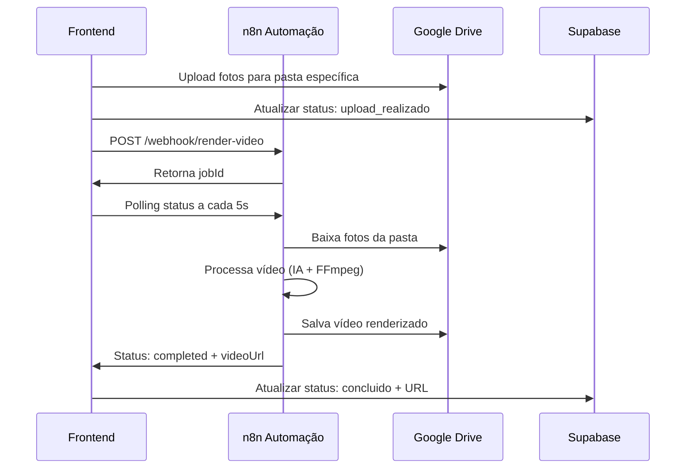

# 🎬 Guia de Integração n8n - Renderização de Vídeos

Este documento detalha como a funcionalidade de renderização de vídeos foi estruturada no backend para integração com automação n8n.

## 📋 Índice

- [Fluxo de Dados](#fluxo-de-dados)
- [Endpoints da Automação](#endpoints-da-automação)
- [Estrutura de Dados](#estrutura-de-dados)
- [Monitoramento de Status](#monitoramento-de-status)
- [Configurações Necessárias](#configurações-necessárias)
- [Tratamento de Erros](#tratamento-de-erros)
- [Checklist para Implementação](#checklist-para-implementação)

---

## 🔄 Fluxo de Dados



---

## 🌐 Endpoints da Automação

### 1. **Iniciar Renderização** (Obrigatório)

```http
POST {VITE_N8N_BASE_URL}/webhook/render-video
Content-Type: application/json
Authorization: Bearer {VITE_N8N_WEBHOOK_TOKEN} (opcional)
```

**Request Body:**
```json
{
  "videoId": "uuid-do-video-no-supabase",
  "obraName": "Nome da Obra Cliente",
  "driveFolderId": "1Y06FFvPPVIjxeu9P2M7HjPL3CDQsIvgB_subpasta",
  "prompt": "Vista aérea do edifício ao entardecer com movimento suave...",
  "photoCount": 25,
  "timestamp": "2024-01-01T12:00:00.000Z",
  "source": "engflow-app"
}
```

**Response Esperada:**
```json
// Sucesso
{
  "success": true,
  "jobId": "job-uuid-gerado-pelo-n8n",
  "message": "Renderização iniciada com sucesso",
  "estimatedDuration": 600 // segundos (opcional)
}

// Erro
{
  "success": false,
  "jobId": null,
  "message": "Erro: Pasta não encontrada no Google Drive"
}
```

### 2. **Consultar Status** (Obrigatório)

```http
GET {VITE_N8N_BASE_URL}/webhook/video-status/{jobId}
Authorization: Bearer {VITE_N8N_WEBHOOK_TOKEN} (opcional)
```

**Response Esperada:**
```json
{
  "jobId": "job-uuid",
  "status": "pending" | "processing" | "completed" | "error",
  "progress": 75, // 0-100
  "stage": "Renderização Final", // opcional
  "videoUrl": "https://drive.google.com/file/d/xyz/video.mp4", // apenas quando completed
  "error": "Erro específico que ocorreu", // apenas quando error
  "startedAt": "2024-01-01T12:00:00.000Z", // opcional
  "completedAt": "2024-01-01T12:10:00.000Z" // opcional quando completed
}
```

### 3. **Health Check** (Opcional mas Recomendado)

```http
GET {VITE_N8N_BASE_URL}/webhook/health
```

**Response Esperada:**
```json
{
  "status": "ok",
  "timestamp": "2024-01-01T12:00:00.000Z",
  "version": "1.0.0" // opcional
}
```

### 4. **Cancelar Job** (Opcional - Futuro)

```http
DELETE {VITE_N8N_BASE_URL}/webhook/cancel-render/{jobId}
```

**Response Esperada:**
```json
{
  "cancelled": true,
  "jobId": "job-uuid"
}
```

---

## 📊 Estrutura de Dados

### **Dados do Vídeo no Supabase**

A automação pode consultar informações adicionais usando o `videoId`:

```sql
-- Consulta completa do vídeo e obra
SELECT
  v.id,
  v.nome as prompt,
  v.status_renderizacao,
  v.drive_pasta_id,
  v.drive_subpasta_id,
  v.quantidade_fotos,
  o.nome as obra_nome,
  o.endereco,
  o.cliente_id,
  c.nome as cliente_nome
FROM videos v
JOIN obras o ON v.obra_id = o.id
JOIN clientes c ON o.cliente_id = c.id
WHERE v.id = '{videoId}';
```

### **Estrutura da Pasta Google Drive**

```
/video-projetos/
  └── {obraName}_20240101/          # Pasta criada automaticamente
      ├── metadata.json             # Criado automaticamente
      ├── foto-001.jpg              # Upload automático
      ├── foto-002.jpg
      └── ...
      └── video_renderizado.mp4     # ⚠️ Sua automação deve criar aqui
```

### **Conteúdo do metadata.json**

```json
{
  "video_id": "uuid-do-video",
  "projeto_id": "id-da-pasta-drive",
  "projeto_nome": "Nome da Obra",
  "prompt_narracao": "Prompt digitado pelo usuário",
  "total_fotos": 25,
  "created_at": "2024-01-01T12:00:00.000Z",
  "status": "aguardando_processamento",
  "folder_id": "1Y06FFvPPVIjxeu9P2M7HjPL3CDQsIvgB_sub"
}
```

---

## ⏱️ Monitoramento de Status

### **Sistema de Polling Implementado**

O frontend monitora automaticamente o progresso:

- **Intervalo**: 5 segundos
- **Timeout**: 1 hora (720 tentativas)
- **Arquivo**: `src/services/n8nService.ts`

### **Estados de Status**

| Status | Descrição | Progress | Ação do Frontend |
|--------|-----------|----------|------------------|
| `pending` | Job na fila | 0 | Continua polling |
| `processing` | Renderizando | 1-99 | Atualiza UI |
| `completed` | Finalizado | 100 | Para polling + salva URL |
| `error` | Erro ocorrido | - | Para polling + mostra erro |

### **Atualização Automática no Supabase**

Quando `status = "completed"`, o frontend executa:

```sql
UPDATE videos SET
  status_renderizacao = 'concluido',
  arquivo_renderizado_url = '{videoUrl}',
  n8n_job_id = '{jobId}',
  updated_at = NOW()
WHERE id = '{videoId}';
```

---

## ⚙️ Configurações Necessárias

### **Variáveis de Ambiente (.env.local)**

```env
# Configurações n8n
VITE_N8N_BASE_URL=https://sua-instancia.n8n.cloud
VITE_N8N_WEBHOOK_TOKEN=seu_token_opcional_para_seguranca
VITE_N8N_RENDER_WEBHOOK=https://sua-instancia.n8n.cloud/webhook/render-video

# Google Drive (já configurado)
VITE_GOOGLE_CLIENT_ID=365083518345-ejpbgab03oqd1s3k25bmoqid5g6dkprr.apps.googleusercontent.com
VITE_GOOGLE_CLIENT_SECRET=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
VITE_DRIVE_FOLDER_ID=1Y06FFvPPVIjxeu9P2M7HjPL3CDQsIvgB

# Supabase (já configurado)
VITE_SUPABASE_URL=https://ibnrtvrxogkksldvxici.supabase.co
VITE_SUPABASE_ANON_KEY=eyJhbGciOiJIUzI1NiIsInR5cCI6IkpXVCJ9...
```

### **Configuração da Automação n8n**

Sua automação precisa ter acesso aos mesmos serviços:

1. **Google Drive API** - Para baixar fotos e salvar vídeo
2. **Supabase** (opcional) - Para consultar dados adicionais
3. **FFmpeg/IA** - Para processar e renderizar o vídeo

---

## 🚨 Tratamento de Erros

### **Erros Tratados pelo Frontend**

- ❌ **Timeout**: Renderização > 1 hora
- ❌ **Conectividade**: Falha na comunicação com n8n
- ❌ **Resposta Inválida**: JSON malformado ou campos ausentes
- ❌ **Status Error**: Quando automação retorna status "error"
- ❌ **Webhook Down**: n8n inacessível

### **Códigos de Erro Sugeridos**

```json
{
  "success": false,
  "jobId": null,
  "message": "DRIVE_FOLDER_NOT_FOUND",
  "details": "Pasta 1Y06FFvPPVIjxeu9P2M7HjPL3CDQsIvgB não encontrada"
}
```

Códigos sugeridos:
- `DRIVE_FOLDER_NOT_FOUND`
- `INSUFFICIENT_PHOTOS`
- `PROCESSING_ERROR`
- `STORAGE_FULL`
- `INVALID_PROMPT`

---

## ✅ Checklist para Implementação

### **🔧 Configuração Inicial**

- [ ] Configurar variáveis n8n no `.env.local`
- [ ] Testar conectividade: `GET /webhook/health`
- [ ] Validar acesso ao Google Drive da automação
- [ ] Configurar autenticação (se usar `WEBHOOK_TOKEN`)

### **📥 Webhook de Renderização**

- [ ] Implementar `POST /webhook/render-video`
- [ ] Validar todos os campos do request
- [ ] Gerar `jobId` único para cada renderização
- [ ] Retornar response no formato correto
- [ ] Iniciar processamento assíncrono

### **📊 Sistema de Status**

- [ ] Implementar `GET /webhook/video-status/{jobId}`
- [ ] Armazenar progresso do job (0-100)
- [ ] Atualizar status em tempo real
- [ ] Tratar estados: pending → processing → completed/error

### **🎬 Processamento de Vídeo**

- [ ] Baixar fotos da pasta Google Drive
- [ ] Implementar lógica de renderização (IA + FFmpeg)
- [ ] Salvar vídeo final na mesma pasta
- [ ] Gerar URL pública do vídeo
- [ ] Atualizar status para "completed"

### **🧪 Testes**

- [ ] Testar fluxo completo: upload → renderização → conclusão
- [ ] Validar URLs de vídeo retornadas
- [ ] Testar cenários de erro
- [ ] Verificar timeout e cancelamento

---

## 📞 Pontos de Contato

### **Arquivos Relevantes no Frontend**

- `src/services/n8nService.ts` - Comunicação com n8n
- `src/services/googleDrive.ts` - Integração Google Drive
- `src/components/videos/PhotoManager.tsx` - UI de gerenciamento
- `src/pages/Videos.tsx` - Página principal de vídeos
- `src/types/video.ts` - Tipos TypeScript

### **Suporte Técnico**

Para dúvidas sobre a integração, consulte os arquivos mencionados acima ou verifique logs no navegador (Console → Network) durante o processo de renderização.

---

**✨ Status**: Implementação completa ✅
**📅 Última atualização**: Novembro 2024
**🔗 Versão**: 1.0.0