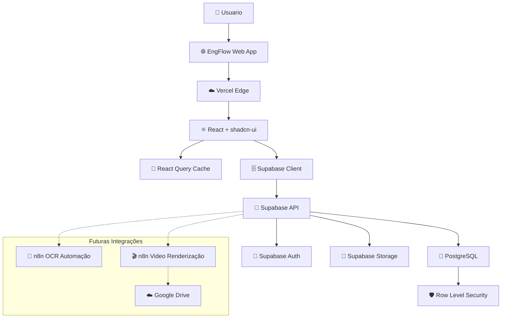
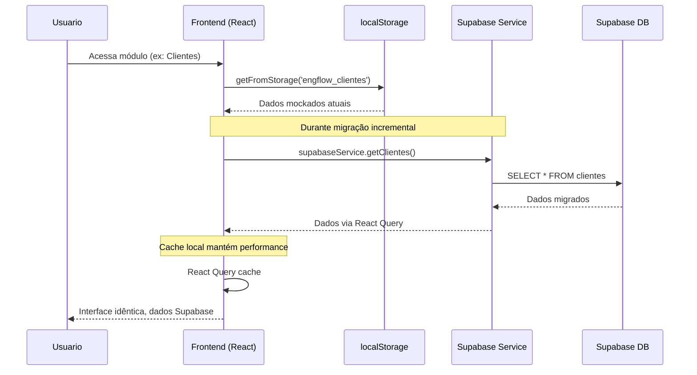
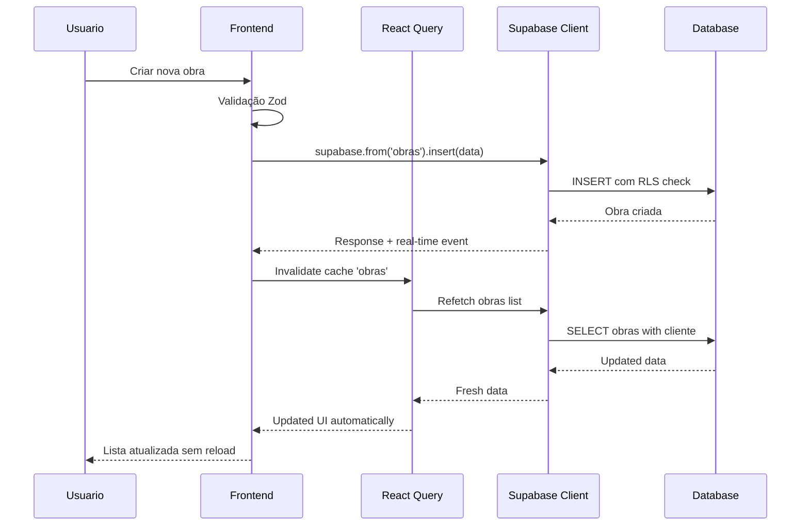
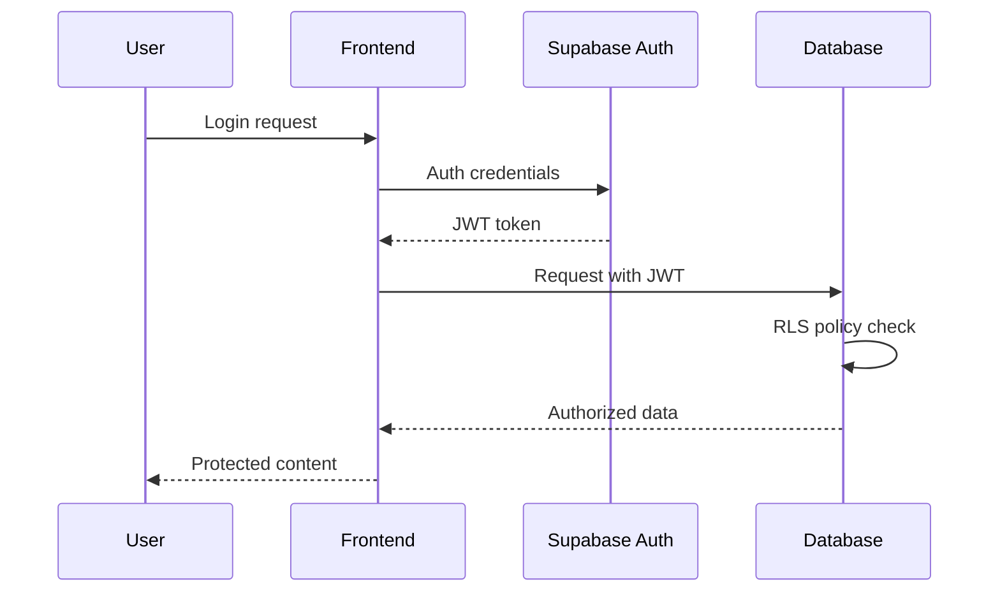
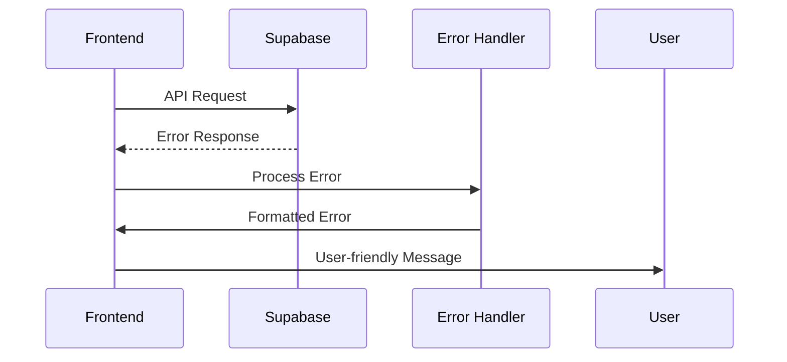

# EngFlow Fullstack Architecture Document

**Template ID**: fullstack-architecture-template-v2
**Versão**: 2.0
**Data de Criação**: 30/10/2025
**Última Atualização**: 30/10/2025

---

## 📋 Change Log

| Date | Version | Description | Author |
|------|---------|-------------|--------|
| 30/10/2025 | v1.0 | Arquitetura inicial para migração localStorage → Supabase | Architect |

---

## 🔍 Introduction

Este documento define a arquitetura fullstack completa para EngFlow, incluindo sistemas backend, implementação frontend, e sua integração. Serve como fonte única da verdade para desenvolvimento orientado por IA, garantindo consistência em toda a stack tecnológica.

Esta abordagem unificada combina o que tradicionalmente seriam documentos separados de arquitetura backend e frontend, simplificando o processo de desenvolvimento para aplicações fullstack modernas onde essas preocupações estão cada vez mais interligadas.

### 🎯 Starter Template ou Projeto Existente

**Projeto Brownfield Identificado**: EngFlow é um projeto existente baseado em React + TypeScript + Vite com shadcn-ui, atualmente operando 100% com localStorage. A migração para Supabase mantém toda a arquitetura frontend existente.

**Decisões Arquiteturais Já Estabelecidas:**
- Frontend: React 18.3.1 + TypeScript + Vite
- UI: shadcn-ui + Tailwind CSS + Radix UI
- Roteamento: React Router DOM
- Formulários: React Hook Form + Zod
- Estado: React Query para cache
- Build: Vite com SWC

**Restrições Impostas:**
- Manter 100% compatibilidade com interface atual
- Preservar todos os componentes shadcn-ui existentes
- Zero mudanças visíveis na UX durante migração
- Manter estrutura de pastas `src/` atual

---

## 🏗️ High Level Architecture

### 📊 Technical Summary

EngFlow adota uma arquitetura fullstack moderna com frontend React mantido e novo backend Supabase. A migração incremental preserva toda funcionalidade existente enquanto estabelece base escalável para automações futuras. O frontend mantém sua arquitetura SPA com shadcn-ui, integrando-se ao Supabase via React Query para cache otimizado. A infraestrutura Supabase fornece PostgreSQL gerenciado, auth nativo, RLS para multi-tenancy, e APIs REST automáticas. Esta arquitetura alcança os objetivos do PRD de migração transparente, preparação para integrações n8n, e estabelecimento de base escalável.

### 🌐 Platform and Infrastructure Choice

**Platform:** Supabase + Vercel
**Key Services:** PostgreSQL, Auth, Storage, Edge Functions, Real-time
**Deployment Host and Regions:** Vercel (Global Edge), Supabase (AWS us-east-1)

**Rationale:** Supabase escolhido por integração nativa com React, auth builtin, RLS para multi-tenancy e velocidade de desenvolvimento vs complexidade de soluções custom AWS.

### 📁 Repository Structure

**Structure:** Monorepo Simples (sem ferramentas complexas)
**Monorepo Tool:** npm workspaces (já presente no projeto)
**Package Organization:** Frontend mantido, serviços Supabase em `src/lib/`

### 🎯 High Level Architecture Diagram



### 🏛️ Architectural Patterns

- **Jamstack Architecture**: SPA React com APIs serverless - _Rationale:_ Performance otimizada e escalabilidade para aplicação de gestão
- **Component-Based UI**: Componentes React reutilizáveis com TypeScript - _Rationale:_ Manutenibilidade e type safety em codebase grande
- **Repository Pattern**: Abstração de acesso a dados via Supabase Client - _Rationale:_ Flexibilidade para futuras migrações e testabilidade
- **Query/Cache Pattern**: React Query para cache otimizado - _Rationale:_ Performance offline e redução de calls desnecessárias
- **Row Level Security**: RLS nativo Supabase - _Rationale:_ Multi-tenancy segura e escalável
- **Progressive Enhancement**: Migração incremental por módulo - _Rationale:_ Zero downtime e rollback granular

---

## 🔧 Tech Stack

Esta é a seleção DEFINITIVA de tecnologias para todo o projeto. Esta tabela é a fonte única da verdade - todo desenvolvimento deve usar essas versões exatas.

### 📋 Technology Stack Table

| Categoria | Tecnologia | Versão | Propósito | Rationale |
|-----------|------------|--------|-----------|-----------|
| **Frontend Language** | TypeScript | 5.8.3 | Linguagem principal frontend | Type safety, melhora DX, já estabelecido no projeto |
| **Frontend Framework** | React | 18.3.1 | Framework UI principal | Ecossistema maduro, já implementado, zero mudanças necessárias |
| **UI Component Library** | shadcn-ui + Radix UI | Latest | Sistema de componentes | Já implementado, acessibilidade nativa, zero redesign |
| **State Management** | React Query | 5.83.0 | Cache e sincronização | Cache inteligente, offline support, ideal para Supabase |
| **Backend Language** | JavaScript/TypeScript | Node 18+ | Runtime Supabase functions | Compartilhamento de tipos, ecosystem unificado |
| **Backend Framework** | Supabase | Latest | BaaS completo | PostgreSQL gerenciado, auth nativo, RLS, APIs automáticas |
| **API Style** | REST + Real-time | Supabase API | Interface backend | APIs REST auto-geradas + real-time subscriptions |
| **Database** | PostgreSQL | 15+ | Banco principal | Relacional maduro, JSON support, RLS nativo |
| **Cache** | React Query + Supabase | Client-side | Cache local e remoto | Performance local + invalidação inteligente |
| **File Storage** | Supabase Storage | Latest | Arquivos e uploads | Integração nativa, CDN builtin, políticas RLS |
| **Authentication** | Supabase Auth | Latest | Auth e autorização | Social login, JWT, RLS integration |
| **Frontend Testing** | Vitest + Testing Library | Latest | Testes unitários/integração | Compatível Vite, ecosystem React |
| **Backend Testing** | Supabase CLI + pgTAP | Latest | Testes database/API | Testes SQL nativos, CI/CD integration |
| **E2E Testing** | Playwright | Latest | Testes end-to-end | Cross-browser, debugger builtin |
| **Build Tool** | Vite | 5.4.19 | Build e dev server | Já configurado, hot reload, otimizações |
| **Bundler** | Vite (Rollup) | Built-in | Bundling produção | Tree shaking, code splitting automático |
| **IaC Tool** | Supabase CLI | Latest | Infrastructure as Code | Database migrations, schema version control |
| **CI/CD** | GitHub Actions | Latest | Automação deploy | Git-based, Vercel integration |
| **Monitoring** | Supabase Dashboard | Built-in | Métricas e logs | Query performance, error tracking |
| **Logging** | Supabase Logs + Vercel | Built-in | Application logs | Centralized logging, real-time monitoring |
| **CSS Framework** | Tailwind CSS | 3.4.17 | Styling system | Já implementado, utility-first, shadcn integration |

---

## 📊 Data Models

Definindo os modelos de dados principais que serão compartilhados entre frontend e backend, baseados na estrutura atual do localStorage:

### 👥 Cliente

**Purpose:** Gerenciamento de clientes físicos e jurídicos com informações completas de contato e endereço

**Key Attributes:**
- id: string (UUID) - Identificador único
- nome: string - Nome completo ou razão social
- tipo: 'fisica' | 'juridica' - Tipo de pessoa
- documento: string - CPF ou CNPJ
- email: string - Contato principal
- telefone: string - Telefone principal
- endereco: string - Logradouro
- numero: string - Número do endereço
- bairro: string - Bairro
- cidade: string - Cidade
- estado: string - Estado/UF
- cep: string - Código postal
- data_cadastro: timestamp - Data de criação

#### TypeScript Interface
```typescript
interface Cliente {
  id: string;
  nome: string;
  tipo: 'fisica' | 'juridica';
  documento: string;
  email: string;
  telefone: string;
  endereco: string;
  numero: string;
  bairro: string;
  cidade: string;
  estado: string;
  cep: string;
  data_cadastro: string;
}
```

#### Relationships
- Has many Obras (1:N)
- Has many Despesas (1:N)

### 🏗️ Obra

**Purpose:** Projetos de engenharia com etapas, progresso e gestão completa de cronograma

**Key Attributes:**
- id: string (UUID) - Identificador único
- nome: string - Nome do projeto
- cliente_id: string - Referência ao cliente
- endereco: string - Local da obra
- numero: string - Número do endereço
- bairro: string - Bairro da obra
- cidade: string - Cidade da obra
- estado: string - Estado da obra
- cep: string - CEP da obra
- data_inicio: date - Data de início
- data_previsao: date - Data prevista fim
- status: string - Status atual
- progresso: number - Percentual conclusão (0-100)
- responsavel: string - Responsável técnico
- orcamento: decimal - Valor orçado
- etapas: jsonb - Array de etapas com sub-objetos

#### TypeScript Interface
```typescript
interface Etapa {
  id?: string;
  nome: string;
  responsavel: string;
  data_inicio: string;
  data_previsao: string;
  progresso?: number;
  status?: string;
}

interface Obra {
  id: string;
  nome: string;
  cliente_id: string;
  endereco: string;
  numero: string;
  bairro: string;
  cidade: string;
  estado: string;
  cep: string;
  data_inicio: string;
  data_previsao?: string;
  status: string;
  progresso: number;
  responsavel: string;
  orcamento?: number;
  etapas?: Etapa[];
  created_at: string;
}
```

#### Relationships
- Belongs to Cliente (N:1)
- Has many Videos (1:N)
- Has many Despesas (1:N)
- Has many Requisicoes (1:N)

### 👤 Funcionario

**Purpose:** Gestão de recursos humanos com hierarquia organizacional

**Key Attributes:**
- id: string (UUID) - Identificador único
- nome: string - Nome completo
- funcao_id: string - Referência à função
- setor_id: string - Referência ao setor
- email: string - Email corporativo
- telefone: string - Telefone contato
- status: string - Status ativo/inativo

#### TypeScript Interface
```typescript
interface Funcionario {
  id: string;
  nome: string;
  funcao_id: string;
  setor_id: string;
  email: string;
  telefone: string;
  status: 'ativo' | 'inativo';
  created_at: string;
}
```

#### Relationships
- Belongs to Funcao (N:1)
- Belongs to Setor (N:1)
- Has many Requisicoes as solicitante (1:N)

### 💰 Despesa

**Purpose:** Controle financeiro com preparação para automação OCR

**Key Attributes:**
- id: string (UUID) - Identificador único
- descricao: string - Descrição da despesa
- cliente_id: string - Cliente relacionado
- obra_id: string - Obra relacionada
- categoria: string - Categoria da despesa
- conta_corrente: string - Conta bancária
- valor_conta: decimal - Valor na conta
- valor_despesa: decimal - Valor da despesa
- data_emissao: date - Data de emissão
- data_registro: date - Data de registro
- forma_pagamento: string - Método pagamento
- nota_fiscal: string - Número NF
- observacao: text - Observações
- comprovante_url: string - URL comprovante (OCR futuro)
- fornecedor_cnpj: string - CNPJ fornecedor (OCR)
- numero_documento: string - Número documento (OCR)

#### TypeScript Interface
```typescript
interface Despesa {
  id: string;
  descricao: string;
  cliente_id: string;
  obra_id: string;
  categoria: string;
  conta_corrente: string;
  valor_conta: number;
  valor_despesa: number;
  data_emissao: string;
  data_registro: string;
  forma_pagamento: string;
  nota_fiscal?: string;
  observacao?: string;
  comprovante_url?: string; // Para OCR
  fornecedor_cnpj?: string; // Para OCR
  numero_documento?: string; // Para OCR
  created_at: string;
}
```

#### Relationships
- Belongs to Cliente (N:1)
- Belongs to Obra (N:1)

### 🎬 Video

**Purpose:** Gestão de vídeos com preparação para automação de renderização

**Key Attributes:**
- id: string (UUID) - Identificador único
- obra_id: string - Obra relacionada
- status: enum - Status de processamento
- progresso: number - Progresso renderização (0-100)
- data_criacao: timestamp - Data criação
- duracao: string - Duração estimada
- tamanho: string - Tamanho arquivo
- prompt: text - Prompt para renderização
- quantidade_fotos: number - Número de fotos
- video_url: string - URL do vídeo final
- drive_pasta_id: string - ID pasta Google Drive
- drive_subpasta_id: string - ID subpasta Drive
- n8n_job_id: string - ID job renderização

#### TypeScript Interface
```typescript
interface Video {
  id: string;
  obra_id: string;
  status: 'concluido' | 'processando' | 'fila' | 'aguardando_fotos';
  progresso: number;
  data_criacao: string;
  duracao: string;
  tamanho: string;
  prompt: string;
  quantidade_fotos?: number;
  video_url?: string;
  drive_pasta_id?: string; // Para integração Google Drive
  drive_subpasta_id?: string; // Para integração Google Drive
  n8n_job_id?: string; // Para tracking automação
}
```

#### Relationships
- Belongs to Obra (N:1)

---

## 📡 API Specification

Baseado no estilo REST + Real-time escolhido no Tech Stack:

### 🔗 Supabase REST API + Real-time

**API Style**: REST APIs auto-geradas pelo Supabase + Real-time subscriptions
**Base URL**: `https://[project-id].supabase.co/rest/v1/`
**Authentication**: Bearer token (JWT) via Supabase Auth

### 📋 Core CRUD Endpoints

**Clientes:**
- `GET /clientes` - Listar clientes com filtros
- `POST /clientes` - Criar novo cliente
- `GET /clientes/{id}` - Buscar cliente específico
- `PATCH /clientes/{id}` - Atualizar cliente
- `DELETE /clientes/{id}` - Remover cliente

**Obras:**
- `GET /obras` - Listar obras com joins para clientes
- `POST /obras` - Criar nova obra
- `GET /obras/{id}` - Buscar obra com detalhes
- `PATCH /obras/{id}` - Atualizar obra
- `DELETE /obras/{id}` - Remover obra
- `GET /obras?cliente_id=eq.{id}` - Obras por cliente

**Despesas:**
- `GET /despesas` - Listar despesas com filtros
- `POST /despesas` - Criar nova despesa
- `GET /despesas/{id}` - Buscar despesa específica
- `PATCH /despesas/{id}` - Atualizar despesa
- `DELETE /despesas/{id}` - Remover despesa
- `GET /despesas?obra_id=eq.{id}` - Despesas por obra

**Videos:**
- `GET /videos` - Listar vídeos com status
- `POST /videos` - Criar novo vídeo
- `GET /videos/{id}` - Buscar vídeo específico
- `PATCH /videos/{id}` - Atualizar progresso/status
- `DELETE /videos/{id}` - Remover vídeo

### 🔄 Real-time Subscriptions

**Video Status Updates:**
```typescript
supabase
  .channel('video-updates')
  .on('postgres_changes',
    { event: 'UPDATE', schema: 'public', table: 'videos' },
    (payload) => {
      // Update UI with new progress/status
    }
  )
  .subscribe()
```

**New Despesas (for OCR automation):**
```typescript
supabase
  .channel('despesa-created')
  .on('postgres_changes',
    { event: 'INSERT', schema: 'public', table: 'despesas' },
    (payload) => {
      // Trigger OCR processing if comprovante_url exists
    }
  )
  .subscribe()
```

---

## 🧩 Components

Baseado nos padrões arquiteturais e tech stack:

### ⚛️ React App Shell
**Responsibility:** Layout principal, navegação, providers globais
**Key Interfaces:** Router configuration, Auth context provider, Query client provider
**Dependencies:** React Router, React Query, Supabase Auth
**Technology Stack:** React 18.3.1 + TypeScript + shadcn-ui

### 🔄 Data Services Layer
**Responsibility:** Abstração das chamadas Supabase, cache management
**Key Interfaces:** CRUD operations abstraction, Real-time subscriptions, Error handling standardization
**Dependencies:** Supabase client, React Query
**Technology Stack:** Supabase-js + React Query + TypeScript

### 🎨 UI Components Library
**Responsibility:** Componentes reutilizáveis, design system
**Key Interfaces:** Form components, Data display components, Navigation components
**Dependencies:** shadcn-ui, Radix UI, Tailwind CSS
**Technology Stack:** React + shadcn-ui + TypeScript

### 🗄️ Supabase PostgreSQL Database
**Responsibility:** Persistência de dados, relacionamentos, constraints
**Key Interfaces:** SQL queries via REST API, Real-time change streams, RLS policy enforcement
**Dependencies:** PostgreSQL extensions, RLS policies
**Technology Stack:** PostgreSQL 15+ + Supabase extensions

### 🔐 Supabase Auth Service
**Responsibility:** Autenticação, autorização, JWT management
**Key Interfaces:** JWT token validation, User management, Session handling
**Dependencies:** Supabase Auth policies
**Technology Stack:** Supabase Auth + JWT

---

## 🔄 Core Workflows

### 🎯 Workflow: Migração de Dados localStorage → Supabase



### 📱 Workflow: CRUD Operations com Cache



---

## 🗄️ Database Schema

Esquema SQL completo baseado nos modelos de dados definidos:

```sql
-- Extensions
CREATE EXTENSION IF NOT EXISTS "uuid-ossp";

-- Tables
CREATE TABLE clientes (
    id UUID DEFAULT uuid_generate_v4() PRIMARY KEY,
    nome VARCHAR NOT NULL,
    tipo VARCHAR CHECK (tipo IN ('fisica', 'juridica')) NOT NULL,
    documento VARCHAR NOT NULL UNIQUE,
    email VARCHAR,
    telefone VARCHAR,
    endereco VARCHAR,
    numero VARCHAR,
    bairro VARCHAR,
    cidade VARCHAR,
    estado VARCHAR(2),
    cep VARCHAR(10),
    data_cadastro TIMESTAMP DEFAULT NOW(),
    created_at TIMESTAMP DEFAULT NOW(),
    updated_at TIMESTAMP DEFAULT NOW()
);

CREATE TABLE obras (
    id UUID DEFAULT uuid_generate_v4() PRIMARY KEY,
    nome VARCHAR NOT NULL,
    cliente_id UUID REFERENCES clientes(id) ON DELETE CASCADE,
    endereco VARCHAR,
    numero VARCHAR,
    bairro VARCHAR,
    cidade VARCHAR,
    estado VARCHAR(2),
    cep VARCHAR(10),
    data_inicio DATE,
    data_previsao DATE,
    status VARCHAR DEFAULT 'planejamento',
    progresso INTEGER DEFAULT 0 CHECK (progresso >= 0 AND progresso <= 100),
    responsavel VARCHAR,
    orcamento DECIMAL(15,2),
    etapas JSONB DEFAULT '[]',
    created_at TIMESTAMP DEFAULT NOW(),
    updated_at TIMESTAMP DEFAULT NOW()
);

CREATE TABLE setores (
    id UUID DEFAULT uuid_generate_v4() PRIMARY KEY,
    nome VARCHAR NOT NULL,
    descricao TEXT,
    created_at TIMESTAMP DEFAULT NOW()
);

CREATE TABLE funcoes (
    id UUID DEFAULT uuid_generate_v4() PRIMARY KEY,
    nome VARCHAR NOT NULL,
    descricao TEXT,
    created_at TIMESTAMP DEFAULT NOW()
);

CREATE TABLE funcionarios (
    id UUID DEFAULT uuid_generate_v4() PRIMARY KEY,
    nome VARCHAR NOT NULL,
    funcao_id UUID REFERENCES funcoes(id),
    setor_id UUID REFERENCES setores(id),
    email VARCHAR,
    telefone VARCHAR,
    status VARCHAR DEFAULT 'ativo',
    created_at TIMESTAMP DEFAULT NOW(),
    updated_at TIMESTAMP DEFAULT NOW()
);

CREATE TABLE despesas (
    id UUID DEFAULT uuid_generate_v4() PRIMARY KEY,
    descricao VARCHAR NOT NULL,
    cliente_id UUID REFERENCES clientes(id),
    obra_id UUID REFERENCES obras(id),
    categoria VARCHAR,
    conta_corrente VARCHAR,
    valor_conta DECIMAL(15,2),
    valor_despesa DECIMAL(15,2),
    data_emissao DATE,
    data_registro DATE,
    forma_pagamento VARCHAR,
    nota_fiscal VARCHAR,
    observacao TEXT,
    -- Campos para futura integração OCR
    comprovante_url VARCHAR,
    fornecedor_cnpj VARCHAR,
    numero_documento VARCHAR,
    created_at TIMESTAMP DEFAULT NOW(),
    updated_at TIMESTAMP DEFAULT NOW()
);

CREATE TABLE videos (
    id UUID DEFAULT uuid_generate_v4() PRIMARY KEY,
    obra_id UUID REFERENCES obras(id) ON DELETE CASCADE,
    status VARCHAR CHECK (status IN ('concluido', 'processando', 'fila', 'aguardando_fotos')) DEFAULT 'aguardando_fotos',
    progresso INTEGER DEFAULT 0 CHECK (progresso >= 0 AND progresso <= 100),
    data_criacao TIMESTAMP DEFAULT NOW(),
    duracao VARCHAR,
    tamanho VARCHAR,
    prompt TEXT,
    quantidade_fotos INTEGER,
    video_url VARCHAR,
    -- Campos para integração Google Drive
    drive_pasta_id VARCHAR,
    drive_subpasta_id VARCHAR,
    -- Campo para tracking automação n8n
    n8n_job_id VARCHAR,
    created_at TIMESTAMP DEFAULT NOW(),
    updated_at TIMESTAMP DEFAULT NOW()
);

CREATE TABLE requisicoes (
    id UUID DEFAULT uuid_generate_v4() PRIMARY KEY,
    titulo VARCHAR NOT NULL,
    obra_id UUID REFERENCES obras(id),
    solicitante_id UUID REFERENCES funcionarios(id),
    prioridade VARCHAR DEFAULT 'media',
    categoria VARCHAR,
    status VARCHAR DEFAULT 'aberta',
    descricao TEXT,
    created_at TIMESTAMP DEFAULT NOW(),
    updated_at TIMESTAMP DEFAULT NOW()
);

-- Indexes for performance
CREATE INDEX idx_obras_cliente_id ON obras(cliente_id);
CREATE INDEX idx_obras_status ON obras(status);
CREATE INDEX idx_despesas_obra_id ON despesas(obra_id);
CREATE INDEX idx_despesas_cliente_id ON despesas(cliente_id);
CREATE INDEX idx_videos_obra_id ON videos(obra_id);
CREATE INDEX idx_videos_status ON videos(status);
CREATE INDEX idx_requisicoes_obra_id ON requisicoes(obra_id);
CREATE INDEX idx_funcionarios_funcao_id ON funcionarios(funcao_id);
CREATE INDEX idx_funcionarios_setor_id ON funcionarios(setor_id);

-- RLS Policies (preparação para multi-tenancy)
ALTER TABLE clientes ENABLE ROW LEVEL SECURITY;
ALTER TABLE obras ENABLE ROW LEVEL SECURITY;
ALTER TABLE funcionarios ENABLE ROW LEVEL SECURITY;
ALTER TABLE despesas ENABLE ROW LEVEL SECURITY;
ALTER TABLE videos ENABLE ROW LEVEL SECURITY;
ALTER TABLE requisicoes ENABLE ROW LEVEL SECURITY;

-- Políticas básicas (expandir para multi-tenancy futuro)
CREATE POLICY "Enable all for authenticated users" ON clientes FOR ALL TO authenticated USING (true);
CREATE POLICY "Enable all for authenticated users" ON obras FOR ALL TO authenticated USING (true);
CREATE POLICY "Enable all for authenticated users" ON funcionarios FOR ALL TO authenticated USING (true);
CREATE POLICY "Enable all for authenticated users" ON despesas FOR ALL TO authenticated USING (true);
CREATE POLICY "Enable all for authenticated users" ON videos FOR ALL TO authenticated USING (true);
CREATE POLICY "Enable all for authenticated users" ON requisicoes FOR ALL TO authenticated USING (true);
```

---

## 🏗️ Frontend Architecture

### 🧩 Component Architecture

#### Component Organization
```
src/
├── components/
│   ├── ui/                    # shadcn-ui base components
│   ├── forms/                 # Form components específicos
│   ├── layouts/               # Layout components
│   └── business/              # Business logic components
├── pages/                     # Route components
├── hooks/                     # Custom hooks
└── services/                  # API services
```

#### Component Template
```typescript
import { useState } from 'react';
import { Card, CardContent, CardHeader, CardTitle } from '@/components/ui/card';
import { useSupabaseQuery } from '@/hooks/useSupabase';

interface ComponentProps {
  // Props interface
}

export const ComponentName: React.FC<ComponentProps> = ({ }) => {
  // Component logic

  return (
    <Card>
      <CardHeader>
        <CardTitle>Component Title</CardTitle>
      </CardHeader>
      <CardContent>
        {/* Component content */}
      </CardContent>
    </Card>
  );
};
```

### 🔄 State Management Architecture

#### State Structure
```typescript
// React Query based state management
interface AppState {
  clientes: Cliente[];
  obras: Obra[];
  despesas: Despesa[];
  videos: Video[];
  // Cached via React Query
}
```

#### State Management Patterns
- Server state via React Query
- Local UI state via useState
- Form state via React Hook Form
- Global state minimal (auth only)

### 🛣️ Routing Architecture

#### Route Organization
```
/                           # Dashboard
/clientes                   # Cliente management
/obras                      # Obra management
/financeiro                 # Despesas management
/videos                     # Video management
/cadastros/funcionarios     # HR management
/cadastros/funcoes          # Funcoes management
/cadastros/setores          # Setores management
/requisicoes               # Requisicoes management
```

#### Protected Route Pattern
```typescript
const ProtectedRoute: React.FC<{ children: React.ReactNode }> = ({ children }) => {
  const { user, loading } = useAuth();

  if (loading) return <LoadingSpinner />;
  if (!user) return <Navigate to="/login" />;

  return <>{children}</>;
};
```

### 🔌 Frontend Services Layer

#### API Client Setup
```typescript
import { createClient } from '@supabase/supabase-js';
import { Database } from '@/types/database';

export const supabase = createClient<Database>(
  process.env.VITE_SUPABASE_URL!,
  process.env.VITE_SUPABASE_ANON_KEY!
);
```

#### Service Example
```typescript
export const clienteService = {
  async getAll() {
    const { data, error } = await supabase
      .from('clientes')
      .select('*')
      .order('nome');

    if (error) throw error;
    return data;
  },

  async create(cliente: Omit<Cliente, 'id' | 'created_at'>) {
    const { data, error } = await supabase
      .from('clientes')
      .insert(cliente)
      .select()
      .single();

    if (error) throw error;
    return data;
  }
};
```

---

## 🗄️ Backend Architecture

### 🏗️ Service Architecture

#### Supabase-based Architecture
Como escolhemos Supabase, a arquitetura backend é baseada em:
- PostgreSQL gerenciado
- APIs REST auto-geradas
- Real-time subscriptions
- Edge Functions para lógica customizada

#### Database Access Patterns
```sql
-- Exemplo de query com RLS
SELECT obras.*, clientes.nome as cliente_nome
FROM obras
JOIN clientes ON obras.cliente_id = clientes.id
WHERE clientes.tenant_id = auth.jwt() ->> 'tenant_id';
```

### 🔐 Authentication and Authorization

#### Auth Flow


#### Middleware/Guards
```typescript
// RLS automaticamente aplicada via Supabase
// Policies definem acesso baseado em JWT claims
CREATE POLICY "Users can only see their tenant data" ON clientes
  FOR ALL TO authenticated
  USING (tenant_id = auth.jwt() ->> 'tenant_id');
```

---

## 🏗️ Unified Project Structure

Estrutura de projeto adaptada para migração localStorage → Supabase:

```
engflow/
├── .github/                    # CI/CD workflows
│   └── workflows/
│       ├── ci.yaml            # Tests e lint
│       └── deploy.yaml        # Deploy Vercel
├── docs/                      # Documentação
│   ├── prd.md                # PRD completo
│   ├── architecture.md       # Este documento
│   └── plans/                # Planejamentos BMAD
├── src/                      # Aplicação React (atual)
│   ├── components/           # Componentes UI
│   │   ├── ui/              # shadcn-ui components
│   │   ├── AppSidebar.tsx   # Navegação principal
│   │   └── ...              # Componentes existentes
│   ├── pages/               # Pages/Routes
│   │   ├── cadastros/       # Módulos CRUD
│   │   ├── Dashboard.tsx    # Dashboard principal
│   │   ├── Financeiro.tsx   # Gestão despesas
│   │   └── ...              # Páginas existentes
│   ├── hooks/               # Custom React hooks
│   │   ├── use-toast.ts     # Toast notifications
│   │   └── use-mobile.tsx   # Responsividade
│   ├── lib/                 # Utilitários e serviços
│   │   ├── localStorage.ts  # [MIGRAR] → supabaseService.ts
│   │   ├── supabaseClient.ts # [NOVO] Cliente Supabase
│   │   ├── supabaseService.ts # [NOVO] Camada abstração
│   │   └── utils.ts         # Utilitários gerais
│   ├── types/               # [NOVO] Definições TypeScript
│   │   ├── database.ts      # Tipos auto-gerados Supabase
│   │   └── entities.ts      # Interfaces de negócio
│   └── App.tsx              # Root component
├── supabase/                # [NOVO] Configurações Supabase
│   ├── migrations/          # SQL migrations
│   ├── functions/           # Edge functions (futuro)
│   └── config.toml          # Configuração local
├── public/                  # Assets estáticos
├── tests/                   # [NOVO] Testes
│   ├── __mocks__/          # Mocks Supabase
│   ├── integration/        # Testes integração
│   └── utils/              # Utilitários teste
├── .env.local.example      # Variáveis ambiente
├── package.json            # Dependências (+ @supabase/supabase-js)
├── tailwind.config.ts      # Configuração Tailwind
├── vite.config.ts          # Configuração Vite
├── CLAUDE.md               # Instruções Claude Code
├── rules.md                # Regras desenvolvimento
└── README.md               # Documentação projeto
```

---

## 🚀 Development Workflow

### 💻 Local Development Setup

#### Prerequisites
```bash
# Node.js 18+
node --version

# Supabase CLI
npm install -g supabase

# Verificar instalação
supabase --version
```

#### Initial Setup
```bash
# Clone e setup
git clone <repository-url>
cd engflow
npm install

# Configurar Supabase local
supabase init
supabase start

# Aplicar migrations
supabase db reset

# Configurar env
cp .env.local.example .env.local
# Editar com URLs do Supabase local
```

#### Development Commands
```bash
# Start frontend (mantido)
npm run dev

# Start Supabase local
supabase start

# Reset database com seed data
supabase db reset

# Generate types
supabase gen types typescript --local > src/types/database.ts

# Run tests
npm run test
npm run test:integration
```

### 🌍 Environment Configuration

#### Frontend (.env.local)
```bash
VITE_SUPABASE_URL=http://localhost:54321
VITE_SUPABASE_ANON_KEY=your-local-anon-key
VITE_APP_URL=http://localhost:5173
```

#### Supabase (supabase/config.toml)
```toml
[api]
port = 54321
schemas = ["public"]
max_rows = 1000

[db]
port = 54322
major_version = 15
```

---

## 🚀 Deployment Architecture

### 🎯 Deployment Strategy

**Frontend Deployment:**
- **Platform:** Vercel
- **Build Command:** `npm run build`
- **Output Directory:** `dist`
- **CDN/Edge:** Vercel Edge Network global

**Backend Deployment:**
- **Platform:** Supabase Cloud
- **Build Command:** N/A (managed service)
- **Deployment Method:** Git-based deployments

### 🔄 CI/CD Pipeline

```yaml
# .github/workflows/deploy.yaml
name: Deploy
on:
  push:
    branches: [main]

jobs:
  test:
    runs-on: ubuntu-latest
    steps:
      - uses: actions/checkout@v3
      - uses: actions/setup-node@v3
        with:
          node-version: 18
      - run: npm ci
      - run: npm run lint
      - run: npm run test

  deploy-frontend:
    needs: test
    runs-on: ubuntu-latest
    steps:
      - uses: actions/checkout@v3
      - uses: amondnet/vercel-action@v20
        with:
          vercel-token: ${{ secrets.VERCEL_TOKEN }}
          vercel-org-id: ${{ secrets.ORG_ID }}
          vercel-project-id: ${{ secrets.PROJECT_ID }}

  deploy-database:
    needs: test
    runs-on: ubuntu-latest
    steps:
      - uses: actions/checkout@v3
      - uses: supabase/setup-cli@v1
      - run: supabase db push
        env:
          SUPABASE_ACCESS_TOKEN: ${{ secrets.SUPABASE_ACCESS_TOKEN }}
```

### 🌐 Environments

| Environment | Frontend URL | Backend URL | Purpose |
|-------------|-------------|-------------|---------|
| Development | http://localhost:5173 | http://localhost:54321 | Local development |
| Staging | https://engflow-staging.vercel.app | https://staging-project.supabase.co | Pre-production testing |
| Production | https://engflow.vercel.app | https://prod-project.supabase.co | Live environment |

---

## 🔒 Security and Performance

### 🛡️ Security Requirements

**Frontend Security:**
- CSP Headers: Configurado via Vercel para prevenir XSS
- XSS Prevention: Sanitização automática React + validação Zod
- Secure Storage: JWT em httpOnly cookies via Supabase Auth

**Backend Security:**
- Input Validation: Validação automática via PostgreSQL constraints + RLS
- Rate Limiting: Configurado via Supabase dashboard
- CORS Policy: Configurado para domínios específicos

**Authentication Security:**
- Token Storage: JWT seguro via Supabase Auth
- Session Management: Refresh automático de tokens
- Password Policy: Configurado via Supabase Auth policies

### ⚡ Performance Optimization

**Frontend Performance:**
- Bundle Size Target: < 500KB initial bundle
- Loading Strategy: Lazy loading de rotas + React Query cache
- Caching Strategy: React Query + Service Worker (futuro)

**Backend Performance:**
- Response Time Target: < 500ms para 95% das requests
- Database Optimization: Índices otimizados + query optimization
- Caching Strategy: Supabase edge cache + CDN

---

## 🧪 Testing Strategy

### 🔺 Testing Pyramid

```
       E2E Tests (Playwright)
      /                    \
   Integration Tests        \
  /               \          \
Frontend Unit    Backend Unit  \
(Vitest +        (pgTAP +       \
 Testing Library) Supabase CLI)  \
```

### 📋 Test Organization

#### Frontend Tests
```
src/
├── __tests__/
│   ├── components/
│   ├── pages/
│   ├── hooks/
│   └── services/
└── setupTests.ts
```

#### Backend Tests
```
supabase/
├── tests/
│   ├── database/
│   ├── functions/
│   └── integration/
└── test-config.sql
```

#### E2E Tests
```
e2e/
├── specs/
│   ├── auth.spec.ts
│   ├── crud.spec.ts
│   └── workflows.spec.ts
├── fixtures/
└── playwright.config.ts
```

### 📝 Test Examples

#### Frontend Component Test
```typescript
import { render, screen } from '@testing-library/react';
import { QueryClient, QueryClientProvider } from '@tanstack/react-query';
import { ClientesList } from '@/components/ClientesList';

test('renders clientes list', async () => {
  const queryClient = new QueryClient();

  render(
    <QueryClientProvider client={queryClient}>
      <ClientesList />
    </QueryClientProvider>
  );

  expect(screen.getByText('Clientes')).toBeInTheDocument();
});
```

#### Backend API Test
```sql
-- pgTAP test example
BEGIN;
SELECT plan(3);

SELECT has_table('clientes');
SELECT has_column('clientes', 'nome');
SELECT col_not_null('clientes', 'nome');

SELECT finish();
ROLLBACK;
```

---

## 📏 Coding Standards

### ⚠️ Critical Fullstack Rules

- **Type Sharing:** Sempre definir tipos em src/types/ e importar de lá
- **API Calls:** Nunca fazer chamadas HTTP diretas - usar a camada de serviços
- **Environment Variables:** Acessar apenas através de objetos config, nunca process.env diretamente
- **Error Handling:** Todas as operações Supabase devem usar o handler de erro padrão
- **State Updates:** Nunca mutar estado diretamente - usar padrões React Query apropriados

### 📛 Naming Conventions

| Element | Frontend | Backend | Example |
|---------|----------|---------|---------|
| Components | PascalCase | - | `ClienteForm.tsx` |
| Hooks | camelCase with 'use' | - | `useClientes.ts` |
| API Endpoints | - | snake_case | `/api/clientes` |
| Database Tables | - | snake_case | `clientes` |

---

## 🚨 Error Handling Strategy

### 🔄 Error Flow



### 📋 Error Response Format

```typescript
interface ApiError {
  error: {
    code: string;
    message: string;
    details?: Record<string, any>;
    timestamp: string;
    requestId: string;
  };
}
```

### ⚛️ Frontend Error Handling

```typescript
export const useErrorHandler = () => {
  const { toast } = useToast();

  const handleError = (error: any) => {
    console.error('Error:', error);

    const message = error.message || 'Ocorreu um erro inesperado';

    toast({
      title: 'Erro',
      description: message,
      variant: 'destructive'
    });
  };

  return { handleError };
};
```

### 🗄️ Backend Error Handling

```sql
-- RLS policies automaticamente geram erros apropriados
-- Constraints de DB geram erros estruturados
-- Supabase Auth maneja erros de autenticação
```

---

## 📊 Monitoring and Observability

### 📈 Monitoring Stack

- **Frontend Monitoring:** Vercel Analytics + Web Vitals
- **Backend Monitoring:** Supabase Dashboard + Metrics
- **Error Tracking:** Supabase Logs + Console integration
- **Performance Monitoring:** React Query DevTools + Supabase Performance

### 📊 Key Metrics

**Frontend Metrics:**
- Core Web Vitals (LCP, FID, CLS)
- JavaScript errors
- API response times
- User interactions

**Backend Metrics:**
- Request rate
- Error rate
- Response time
- Database query performance

---

**Status da Arquitetura**: ✅ **COMPLETA E PRONTA PARA IMPLEMENTAÇÃO**

Este documento serve como especificação definitiva para a migração EngFlow localStorage → Supabase e deve ser usado como referência única durante todo o processo de desenvolvimento.