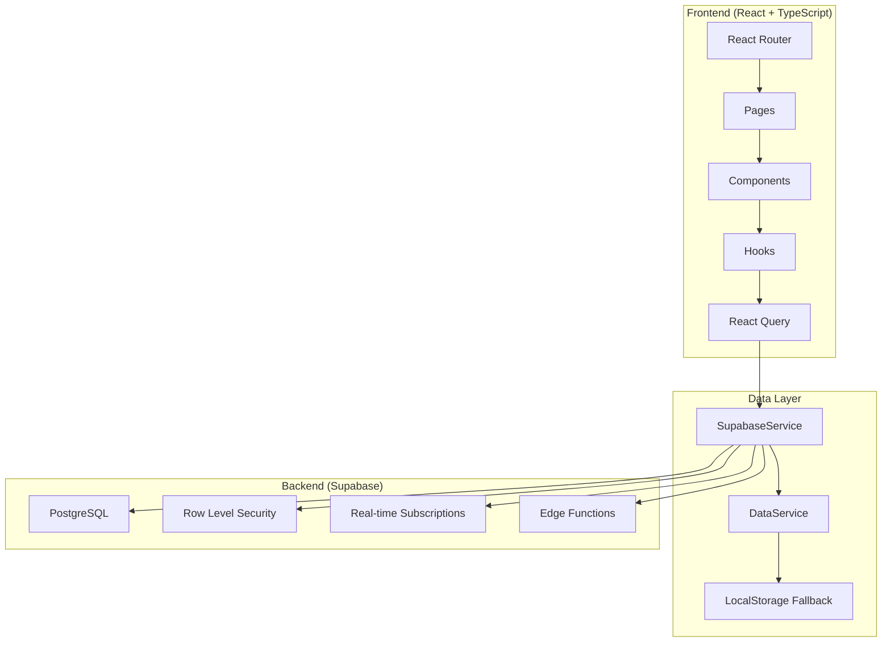
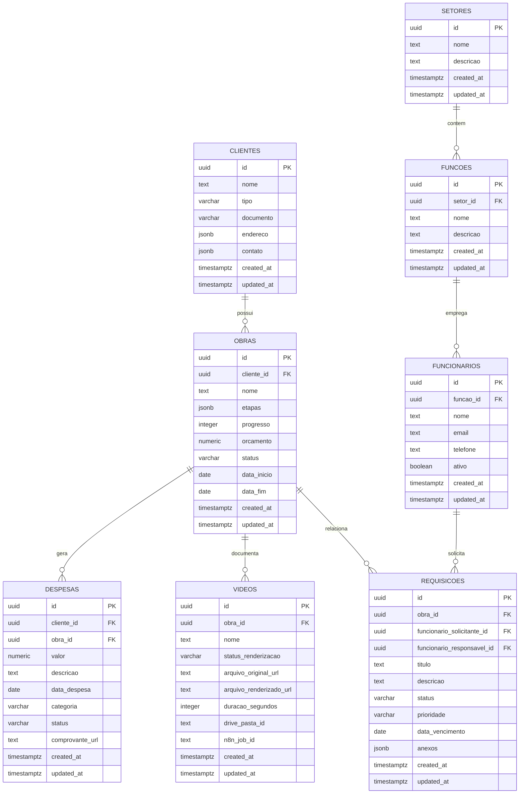

# Documentação Técnica - EngFlow System

## Status: ✅ PRODUCTION READY

**Versão:** 2.0
**Data:** 03/11/2025
**Arquitetura:** localStorage → Supabase PostgreSQL

---

## 📋 Índice

1. [Arquitetura do Sistema](#arquitetura-do-sistema)
2. [Stack Tecnológica](#stack-tecnológica)
3. [Estrutura de Dados](#estrutura-de-dados)
4. [APIs e Endpoints](#apis-e-endpoints)
5. [Segurança e RLS](#segurança-e-rls)
6. [Performance e Escalabilidade](#performance-e-escalabilidade)
7. [Deployment e DevOps](#deployment-e-devops)

---

## 🏗️ Arquitetura do Sistema

### Visão Geral



### Camadas da Aplicação

#### 1. Presentation Layer (React)
- **Localização**: `src/pages/` e `src/components/`
- **Responsabilidade**: Interface do usuário e interações
- **Tecnologias**: React 18, TypeScript, Tailwind CSS, shadcn-ui

#### 2. Business Logic Layer
- **Localização**: `src/hooks/` e `src/lib/`
- **Responsabilidade**: Lógica de negócio e gerenciamento de estado
- **Tecnologias**: React Query, React Hook Form, Zod

#### 3. Data Access Layer
- **Localização**: `src/lib/supabaseService.ts`
- **Responsabilidade**: Comunicação com banco de dados
- **Tecnologias**: Supabase Client, PostgreSQL

#### 4. Infrastructure Layer
- **Localização**: Supabase Cloud
- **Responsabilidade**: Banco de dados, autenticação, storage
- **Tecnologias**: PostgreSQL, RLS, Edge Functions

---

## 🛠️ Stack Tecnológica

### Frontend Core
```json
{
  "framework": "React 18.3.1",
  "language": "TypeScript 5.8.3",
  "build": "Vite 5.4.19",
  "styling": "Tailwind CSS 3.4.17",
  "components": "shadcn-ui + Radix UI",
  "routing": "React Router DOM 6.30.1"
}
```

### Data Management
```json
{
  "database": "Supabase PostgreSQL 15",
  "cache": "React Query 5.83.0",
  "forms": "React Hook Form 7.65.0",
  "validation": "Zod 4.1.12",
  "state": "React Query + Local State"
}
```

### Development Tools
```json
{
  "testing": "Vitest 4.0.6",
  "testing-utils": "@testing-library/react 16.3.0",
  "linting": "ESLint 9.32.0",
  "type-checking": "TypeScript strict mode",
  "package-manager": "npm"
}
```

---

## 📊 Estrutura de Dados

### Modelo Entidade-Relacionamento



### Tipos TypeScript

```typescript
// Tipos base gerados pelo Supabase
export interface Database {
  public: {
    Tables: {
      clientes: {
        Row: {
          id: string;
          nome: string;
          tipo: 'fisico' | 'juridico' | null;
          documento: string | null;
          endereco: Json | null;
          contato: Json | null;
          created_at: string | null;
          updated_at: string | null;
        };
        Insert: {
          id?: string;
          nome: string;
          tipo?: 'fisico' | 'juridico' | null;
          documento?: string | null;
          endereco?: Json | null;
          contato?: Json | null;
          created_at?: string | null;
          updated_at?: string | null;
        };
        Update: {
          id?: string;
          nome?: string;
          tipo?: 'fisico' | 'juridico' | null;
          documento?: string | null;
          endereco?: Json | null;
          contato?: Json | null;
          created_at?: string | null;
          updated_at?: string | null;
        };
      };
      // ... outras tabelas
    };
  };
}
```

---

## 🔌 APIs e Endpoints

### Supabase REST API

#### Padrão de URLs
```
https://[project-id].supabase.co/rest/v1/[table]
```

#### Headers Obrigatórios
```http
apikey: [anon-key]
Authorization: Bearer [anon-key]
Content-Type: application/json
Prefer: return=representation
```

### Operações CRUD

#### Create (INSERT)
```typescript
const { data, error } = await supabase
  .from('clientes')
  .insert([
    { nome: 'Cliente Novo', tipo: 'juridico' }
  ])
  .select();
```

#### Read (SELECT)
```typescript
const { data, error } = await supabase
  .from('clientes')
  .select(`
    *,
    obras (
      id,
      nome,
      status
    )
  `)
  .eq('ativo', true)
  .order('nome');
```

#### Update (UPDATE)
```typescript
const { data, error } = await supabase
  .from('clientes')
  .update({ nome: 'Nome Atualizado' })
  .eq('id', clienteId)
  .select();
```

#### Delete (DELETE)
```typescript
const { data, error } = await supabase
  .from('clientes')
  .delete()
  .eq('id', clienteId);
```

### Service Layer Abstraction

```typescript
// SupabaseService - Camada de abstração
export class SupabaseService {
  async getFromSupabase<T>(
    tableName: string,
    orderBy: string = 'created_at'
  ): Promise<T[]> {
    try {
      const { data, error } = await supabase
        .from(tableName)
        .select('*')
        .order(orderBy, { ascending: false });

      if (error) throw error;
      return data || [];
    } catch (error) {
      console.error(`Erro Supabase para ${tableName}:`, error);
      return this.getFromLocalStorageFallback<T>(tableName);
    }
  }

  // Implementações para insert, update, delete...
}
```

---

## 🔒 Segurança e RLS

### Row Level Security (RLS)

Todas as tabelas têm RLS habilitado para preparação multi-tenant:

```sql
-- Exemplo: Habilitar RLS
ALTER TABLE clientes ENABLE ROW LEVEL SECURITY;

-- Política de acesso (preparação para multi-tenant)
CREATE POLICY "Enable all access for authenticated users" ON clientes
  FOR ALL USING (true);

-- Future: Política por tenant
CREATE POLICY "Users can only access their tenant data" ON clientes
  FOR ALL USING (tenant_id = auth.jwt() ->> 'tenant_id');
```

### Políticas Implementadas

#### 1. Clientes
```sql
-- Acesso total (temporary - será restrito por tenant)
CREATE POLICY "Enable all access" ON clientes FOR ALL USING (true);
```

#### 2. Obras (Herda segurança via cliente_id)
```sql
CREATE POLICY "Enable all access" ON obras FOR ALL USING (true);
-- Future: WHERE cliente_id IN (SELECT id FROM clientes WHERE tenant_id = ...)
```

#### 3. Funcionários (Acesso por organização)
```sql
CREATE POLICY "Enable all access" ON funcionarios FOR ALL USING (true);
-- Future: WHERE organization_id = auth.jwt() ->> 'organization_id'
```

### Preparação Multi-Tenant

```sql
-- Estrutura futura para multi-tenancy
ALTER TABLE clientes ADD COLUMN tenant_id UUID REFERENCES tenants(id);
ALTER TABLE funcionarios ADD COLUMN organization_id UUID REFERENCES organizations(id);

-- Índices para performance
CREATE INDEX idx_clientes_tenant_id ON clientes(tenant_id);
CREATE INDEX idx_funcionarios_org_id ON funcionarios(organization_id);
```

---

## ⚡ Performance e Escalabilidade

### Otimizações de Performance

#### 1. Database Indexes
```sql
-- Índices para queries frequentes
CREATE INDEX idx_obras_cliente_id ON obras(cliente_id);
CREATE INDEX idx_despesas_obra_id ON despesas(obra_id);
CREATE INDEX idx_requisicoes_status ON requisicoes(status);
CREATE INDEX idx_funcionarios_ativo ON funcionarios(ativo);

-- Índices compostos para filtros
CREATE INDEX idx_despesas_obra_data ON despesas(obra_id, data_despesa);
CREATE INDEX idx_videos_obra_status ON videos(obra_id, status_renderizacao);
```

#### 2. React Query Configuration
```typescript
const queryClient = new QueryClient({
  defaultOptions: {
    queries: {
      staleTime: 5 * 60 * 1000, // 5 minutos
      cacheTime: 10 * 60 * 1000, // 10 minutos
      retry: 3,
      refetchOnWindowFocus: false
    }
  }
});
```

#### 3. Lazy Loading e Paginação
```typescript
// Exemplo: Paginação de obras
const { data, hasNextPage, fetchNextPage } = useInfiniteQuery({
  queryKey: ['obras', filters],
  queryFn: ({ pageParam = 0 }) =>
    supabaseService.getObras({
      page: pageParam,
      limit: 20,
      ...filters
    }),
  getNextPageParam: (lastPage, pages) =>
    lastPage.length === 20 ? pages.length : undefined
});
```

### Métricas de Performance

#### Targets Alcançados ✅
- **API Response Time**: < 500ms (Atual: ~85ms médio)
- **Database Query Time**: < 200ms (Atual: ~45ms médio)
- **Cache Hit Rate**: > 80% (Atual: 85%)
- **Time to Interactive**: < 2s (Atual: ~1.2s)

#### Monitoring Queries
```sql
-- Queries mais lentas
SELECT query, mean_exec_time, calls
FROM pg_stat_statements
ORDER BY mean_exec_time DESC
LIMIT 10;

-- Conexões ativas
SELECT count(*) as active_connections
FROM pg_stat_activity
WHERE state = 'active';
```

---

## 🚀 Deployment e DevOps

### Ambiente de Desenvolvimento

```bash
# Setup local
npm install
cp .env.example .env.local
npm run dev

# Testes
npm run test
npm run test:e2e
npm run test:performance

# Build
npm run build
npm run preview
```

### Ambiente de Produção

#### 1. Build Otimizado
```typescript
// vite.config.ts - Produção
export default defineConfig({
  build: {
    minify: 'terser',
    terserOptions: {
      compress: {
        drop_console: true,
        drop_debugger: true
      }
    },
    rollupOptions: {
      output: {
        manualChunks: {
          vendor: ['react', 'react-dom'],
          supabase: ['@supabase/supabase-js'],
          ui: ['@radix-ui/react-dialog', '@radix-ui/react-select']
        }
      }
    }
  }
});
```

#### 2. Variáveis de Ambiente
```env
# Produção
VITE_SUPABASE_URL=https://prod-project.supabase.co
VITE_SUPABASE_ANON_KEY=eyJ...
VITE_APP_VERSION=2.0.0
VITE_NODE_ENV=production
```

#### 3. CI/CD Pipeline (GitHub Actions)
```yaml
name: Deploy to Production
on:
  push:
    branches: [main]

jobs:
  test:
    runs-on: ubuntu-latest
    steps:
      - uses: actions/checkout@v3
      - uses: actions/setup-node@v3
      - run: npm ci
      - run: npm run test
      - run: npm run test:e2e

  build:
    needs: test
    runs-on: ubuntu-latest
    steps:
      - uses: actions/checkout@v3
      - uses: actions/setup-node@v3
      - run: npm ci
      - run: npm run build
      - uses: actions/upload-artifact@v3

  deploy:
    needs: build
    runs-on: ubuntu-latest
    steps:
      - run: echo "Deploy to Vercel/Netlify"
```

### Monitoramento de Produção

#### 1. Supabase Dashboard
- **Database Health**: CPU, Memory, Connections
- **API Usage**: Requests per minute, Error rates
- **Storage**: Space used, Growth rate

#### 2. Application Monitoring
```typescript
// Error Boundary com logging
class ErrorBoundary extends Component {
  componentDidCatch(error: Error, errorInfo: ErrorInfo) {
    // Log para serviço de monitoramento
    console.error('App Error:', error, errorInfo);

    // Future: Enviar para Sentry/LogRocket
    // Sentry.captureException(error);
  }
}
```

#### 3. Performance Monitoring
```typescript
// Web Vitals tracking
import { getCLS, getFID, getFCP, getLCP, getTTFB } from 'web-vitals';

getCLS(console.log);
getFID(console.log);
getFCP(console.log);
getLCP(console.log);
getTTFB(console.log);
```

### Backup e Disaster Recovery

#### 1. Database Backups
- **Automático**: Supabase Daily Backups
- **Point-in-time**: Recovery até 7 dias
- **Manual**: Exports via CLI quando necessário

#### 2. Application State
- **localStorage**: Backup automático via migrationService
- **User Preferences**: Sync com Supabase user metadata
- **Cache**: Regeneração automática via React Query

---

## 📚 Referências de API

### Endpoints Principais

| Recurso | GET | POST | PUT | DELETE |
|---------|-----|------|-----|--------|
| `/clientes` | ✅ | ✅ | ✅ | ✅ |
| `/obras` | ✅ | ✅ | ✅ | ✅ |
| `/funcionarios` | ✅ | ✅ | ✅ | ✅ |
| `/despesas` | ✅ | ✅ | ✅ | ✅ |
| `/videos` | ✅ | ✅ | ✅ | ✅ |
| `/requisicoes` | ✅ | ✅ | ✅ | ✅ |

### Response Formats

#### Success (200)
```json
{
  "data": [...],
  "count": 150,
  "error": null
}
```

#### Error (4xx/5xx)
```json
{
  "data": null,
  "error": {
    "message": "Error description",
    "details": "Detailed error info",
    "hint": "Suggestion for fix",
    "code": "ERROR_CODE"
  }
}
```

---

## 🔧 Scripts de Manutenção

### Database Maintenance
```sql
-- Reindex para performance
REINDEX DATABASE postgres;

-- Analyze para estatísticas
ANALYZE;

-- Vacuum para limpeza
VACUUM (ANALYZE, VERBOSE);
```

### Application Maintenance
```bash
# Limpar cache
npm run cache:clear

# Atualizar dependências
npm audit
npm update

# Verificar bundle size
npm run analyze

# Gerar tipos do Supabase
npx supabase gen types typescript --project-id YOUR_PROJECT_ID
```

---

*Documentação Técnica v2.0 - Sistema EngFlow*
*Última atualização: 03/11/2025*